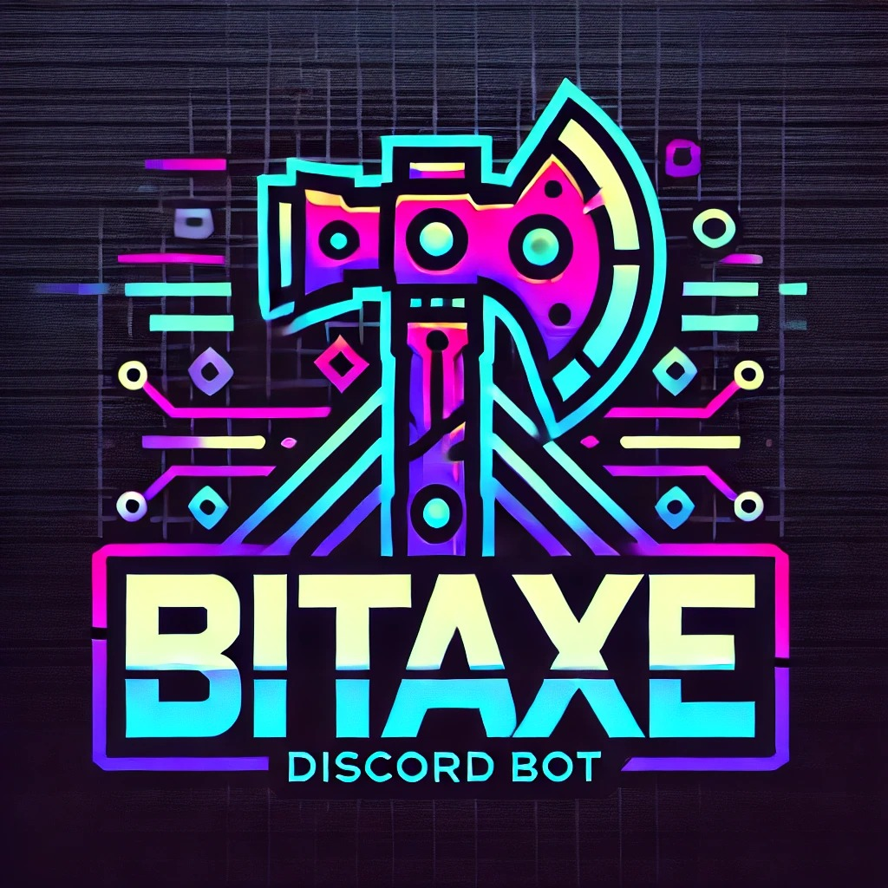

<div align="center">



[](https://github.com/fgrfn/bitaxe-discord-status-bot/releases)
[](https://github.com/fgrfn/bitaxe-discord-status-bot/pkgs/container/bitaxe-discord-status-bot)
[](LICENSE)
[](https://www.python.org/downloads/)
[](https://github.com/fgrfn/bitaxe-discord-status-bot/actions)
[](https://discord.com/)

**Real-Time Discord Monitoring für deine BitAxe & NerdAxe Bitcoin Miner**

Überwache Hashrate, Temperatur, Power & Best-Difficulty mit automatischen Alerts bei kritischen Events.

[Features](#-features) • [Quick Start](#-quick-start) • [Docker](#-docker) • [Konfiguration](#-konfiguration) • [Alerts](#-alert-system) • [Sensoren](#-unterstützte-sensoren)

</div>

---

## 🌟 Features

### 📊 **Umfassende Überwachung**
- **80+ Sensoren** von BitAxe & NerdAxe Geräten
- Echtzeit Power-Consumption, Voltage, Current und Temperatur
- Erweiterte Hashrate-Metriken (instant, 1m, 10m, 1h, 1d Durchschnitte)
- Mining-Statistiken (Shares, Difficulty, gefundene Blocks)
- Network-Informationen (IP, WiFi, Signal-Stärke)
- Hardware-Diagnostics (Heap Memory, Uptime, Reset-Gründe)

### 🎯 **BitAxe & NerdAxe Unterstützung**
- ✅ **BitAxe** - Alle Modelle mit Standard AxeOS Firmware
- ✅ **NerdAxe** - ESP-Miner-NerdAxe Geräte mit erweiterter API
- Automatische Erkennung von Device-Capabilities
- Unterstützung für flache und verschachtelte API-Strukturen

### 🏆 **Best-Difficulty Tracking**
- Automatische Speicherung neuer Rekorde
- Benachrichtigungen bei neuen Best-Difficulty Werten
- Historische Übersicht der Top-Einträge
- Zeitstempel und Device-Zuordnung

### � **Alert-System**
- 🔥 **Temperatur-Alerts** - Warnung bei kritischen Temperaturen (>75°C)
- ⚠️ **Offline-Detection** - Benachrichtigung bei nicht erreichbaren Geräten
- ⏱️ **Smart Cooldown** - Vermeidet Alert-Spam (15 Min Cooldown)
- 👤 **User-Mentions** - Optional Discord User bei Alerts benachrichtigen

### ⚡ **Performance & Reliability**
- 🔄 **Auto-Reconnect** - Automatische Wiederverbindung bei Verbindungsproblemen
- 📦 **API Caching** - Reduziert API-Calls (5s Cache TTL)
- 🚦 **Rate Limiting** - Respektiert Discord API Rate Limits
- 🔒 **Thread-Safe** - Sichere Datei-Operationen mit Threading Locks
- 📝 **Rotating Logs** - Log-Rotation (max 5MB, 3 Backups)

### 🔧 **Erweiterte Features**
- 🐳 **Docker Support** - Vollständige Containerisierung
- 🌍 **Environment Variables** - Flexible Konfiguration ohne config.ini
- 📚 **Type Hints** - Vollständige Type Annotations für bessere IDE-Unterstützung
- 📖 **Docstrings** - Umfassende Dokumentation aller Funktionen
- ✅ **Unit Tests** - Pytest Test-Suite mit >80% Coverage
- 🎯 **Graceful Shutdown** - Sauberes Herunterfahren bei Interrupt

---

## 📦 Installation

### Voraussetzungen
- Python 3.10 oder höher
- Discord Bot Token ([Discord Developer Portal](https://discord.com/developers/applications))
- BitAxe/NerdAxe Miner im lokalen Netzwerk

---

## 🚀 Quick Start

### Option 1: Docker (empfohlen) 🐳

```bash
# 1. Repository klonen
git clone https://github.com/fgrfn/bitaxe-discord-status-bot.git
cd bitaxe-discord-status-bot

# 2. Config erstellen
cp config.ini.example config.ini
nano config.ini  # Token & Channel ID eintragen

# 3. Mit Docker Compose starten
docker-compose up -d

# 4. Logs anschauen
docker-compose logs -f

# Stoppen
docker-compose down
```

**Oder Pre-built Image nutzen:**

```bash
# Latest Version von GitHub Container Registry
docker pull ghcr.io/fgrfn/bitaxe-discord-status-bot:latest

# Mit spezifischer Version
docker pull ghcr.io/fgrfn/bitaxe-discord-status-bot:v2.0.0

# Run
docker run -d \
  --name bitaxe-bot \
  -v $(pwd)/config.ini:/app/config.ini:ro \
  -v $(pwd)/data:/app/data \
  -v $(pwd)/logs:/app/logs \
  -e DISCORD_BOT_TOKEN="dein_token" \
  ghcr.io/fgrfn/bitaxe-discord-status-bot:latest
```

---

### Option 2: Python (lokal)

```bash
# 1. Repository klonen
git clone https://github.com/fgrfn/bitaxe-discord-status-bot.git
cd bitaxe-discord-status-bot

# 2. Virtual Environment
python -m venv venv
source venv/bin/activate  # Windows: venv\Scripts\activate

# 3. Dependencies installieren
pip install -r requirements.txt

# 4. Config erstellen
cp config.ini.example config.ini
nano config.ini

# 5. Bot starten
python src/main.py
```

---

## ⚙️ Konfiguration

### Erforderliche Credentials

| Variable | Beschreibung | Wo bekomme ich das? |
|----------|--------------|---------------------|
| `DISCORD_BOT_TOKEN` | Discord Bot Token | [Discord Developer Portal](https://discord.com/developers/applications) |
| `DISCORD_CHANNEL_ID` | Channel ID für Status-Updates | Discord: Rechtsklick auf Channel → "ID kopieren" |
| `DEVICE_*_IP` | IP-Adresse deiner Miner | Router/BitAxe WebUI |

### config.ini Beispiel

```ini
[Bot]
token = DEIN_DISCORD_BOT_TOKEN
channel_id = 123456789012345678
update_interval = 30              # Sekunden zwischen Updates
mention_user_id = 987654321       # Optional: User ID für Alerts

[bitaxe-gamma]
ip = 192.168.1.100
temp_thresholds = 60,65,70
fan_thresholds = 0,2000,3500,7500
volt_thresholds = 0.95,1.1,1.3
vr_temp_thresholds = 65,75,80

[nerdaxe-ultra]
ip = 192.168.1.101
temp_thresholds = 60,65,70
```

### Environment Variables (Docker-friendly)

Alternativ zu `config.ini` kannst du alles via Umgebungsvariablen konfigurieren:

**Pflicht-Felder:**
```bash
# Bot Konfiguration
DISCORD_BOT_TOKEN=your_token_here
DISCORD_CHANNEL_ID=123456789012345678
UPDATE_INTERVAL=30

# Device Konfiguration (pro Gerät)
DEVICE_BITAXE_GAMMA_IP=192.168.1.100
DEVICE_BITAXE_GAMMA_TEMP_THRESHOLDS=60,65,70
DEVICE_BITAXE_GAMMA_FAN_THRESHOLDS=0,2000,3500,7500
```

**Optional:**
```bash
MENTION_USER_ID=987654321         # Discord User ID für Alerts
```

**Konfigurationspriorität:**
1. Environment Variables (höchste Priorität)
2. config.ini
3. Globale Defaults

---

## 🐳 Docker

### Pre-built Images

Das Projekt stellt automatisch gebaute Docker Images bereit:

| Tag | Beschreibung | Update-Strategie |
|-----|--------------|------------------|
| `latest` | Neueste Version vom main branch | Bei jedem Push zu main |
| `v2.0.0` | Spezifische Release-Version | Für Reproduzierbarkeit |
| `v2.0` | Minor-Version | Latest Patch einer Minor-Version |
| `v2` | Major-Version | Latest Minor/Patch |

```bash
# Latest Version
docker pull ghcr.io/fgrfn/bitaxe-discord-status-bot:latest

# Mit spezifischer Version
docker pull ghcr.io/fgrfn/bitaxe-discord-status-bot:v2.0.0
```
### Docker Compose (empfohlen)

Das Repo enthält ein vollständiges `docker-compose.yml`:

**1. Mit config.ini:**
```bash
# Config erstellen
cp config.ini.example config.ini
nano config.ini

# Starten
docker-compose up -d
```

**2. Mit Environment Variables:**
```bash
# .env erstellen
cp .env.example .env
nano .env

# Starten
docker-compose up -d

# Logs
docker-compose logs -f
```

### Beispiel docker-compose.yml

```yaml
version: '3.8'

services:
  bitaxe-bot:
    image: ghcr.io/fgrfn/bitaxe-discord-status-bot:latest
    container_name: bitaxe-bot
    restart: unless-stopped
    
    environment:
      - TZ=Europe/Berlin
      - DISCORD_BOT_TOKEN=${DISCORD_BOT_TOKEN}
      - DISCORD_CHANNEL_ID=${DISCORD_CHANNEL_ID}
      - UPDATE_INTERVAL=30
      - DEVICE_BITAXE_GAMMA_IP=192.168.1.100
    
    volumes:
      - ./data:/app/data
      - ./logs:/app/logs
    
    logging:
      driver: "json-file"
      options:
        max-size: "10m"
        max-file: "3"
```

---

## 📊 Monitoring & Logs

### Logs ansehen

```bash
# Docker
docker-compose logs -f
docker-compose logs --tail=100 bitaxe-bot

# Lokal
tail -f logs/bot.log
tail -f logs/bot.log | grep ERROR
```

### Log-Dateien

- `logs/bot.log` - Hauptlog mit Rotation (5MB max, 3 Backups)
- `data/best_difficulty.json` - Best-Difficulty Records
- Log-Level: DEBUG (File), INFO (Console)

---

## 🚨 Alert-System

Der Bot überwacht automatisch kritische Zustände und sendet Alerts:

### Alert-Typen

| Alert | Schwellwert | Cooldown |
|-------|-------------|----------|
| 🔥 **Kritische Temperatur** | ≥75°C | 15 Min |
| 🔥 **Kritische VR-Temperatur** | ≥85°C | 15 Min |
| ⚠️ **Gerät Offline** | 3 fehlgeschlagene Checks | 15 Min |

### Alert-Konfiguration

In `config.ini`:
```ini
[Bot]
mention_user_id = 123456789  # Deine Discord User ID
```

Oder via Environment:
```bash
MENTION_USER_ID=123456789
```

**Alert-Format:**
```
⚠️ bitaxe-gamma ist offline! (seit 3 Checks)
🔥 nerdaxe-ultra Kritische Temperatur: 78°C!
<@123456789>  # Optionale User-Mention
```

---

## 🎯 Best-Difficulty Tracking

Der Bot speichert automatisch neue Best-Difficulty Rekorde in `data/best_difficulty.json`:

```json
{
  "bitaxe-gamma": {
    "best_difficulty": "1234567",
    "timestamp": "2026-02-03 14:30:00"
  }
}
```

**Benachrichtigung bei neuem Rekord:**
```
🎉 Neuer Best-Difficulty Rekord für bitaxe-gamma: 1234567
<@123456789>  # Optional
```

---

## 📚 Dokumentation

- [CHANGELOG.md](CHANGELOG.md) - Version History & Changes
- [CONTRIBUTING.md](CONTRIBUTING.md) - Development Guidelines
- [LICENSE](LICENSE) - MIT License

---

## 🔗 Links

- **GitHub Repository**: [fgrfn/bitaxe-discord-status-bot](https://github.com/fgrfn/bitaxe-discord-status-bot)
- **AxeOS-HA-Integration**: [fgrfn/AxeOS-HA-Integration](https://github.com/fgrfn/AxeOS-HA-Integration)
- **BitAxe Projekt**: [BitMaker-hub/ESP-Miner](https://github.com/BitMaker-hub/ESP-Miner)
- **NerdAxe Firmware**: [BitMaker-hub/ESP-Miner-NerdAxe](https://github.com/BitMaker-hub/ESP-Miner-NerdAxe)

---

## 📝 License

MIT License - siehe [LICENSE](LICENSE)

Copyright © 2026 fgrfn

---

<div align="center">

**Entwickelt mit ❤️ für die BitAxe & NerdAxe Community**

⭐ Wenn dir dieses Projekt gefällt, gib uns einen Star!

[Issues](https://github.com/fgrfn/bitaxe-discord-status-bot/issues) • [Pull Requests](https://github.com/fgrfn/bitaxe-discord-status-bot/pulls) • [Discussions](https://github.com/fgrfn/bitaxe-discord-status-bot/discussions)

[⬆ Nach oben](#bitaxe-discord-status-bot)

</div>